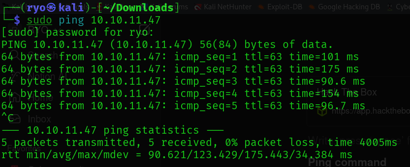

# LinkVortex

- Linux machine

[Hack The Box](https://app.hackthebox.com/machines/LinkVortex)

**Ping command**

- The machine is up and i can communicate with them.

**Nmap**

Done Nmap to find the open ports

**Result:**

There are two open ports:

- 22 ssh
- 80 htttp

After viewing the website I got some error. I was directed to the **linkvortex.htb.** There is a problem in a DNS system. Let’s fix this 

After solving the DNS Issue I was able to view the website.

**Web Technology**

I have also used wappalyzer extension and got the technologies used. But i was not able to screenshot this because in this VM I have to click ctrl+win to search for screenshot option and after clicking this the extension automatically closes.

**Technologies used are:**

- **CMS -** Ghost 5.58
- **Web server**
    - Apache HTTP server
    - Express

- The latest version of **ghost is 5.114.1.**

Seems like the ghost version 5.58 is outdated. let’s check.

[Ghost-5.58-Arbitrary-File-Read-CVE-2023-40028/CVE-2023-40028 at master · 0xDTC/Ghost-5.58-Arbitrary-File-Read-CVE-2023-40028](https://github.com/0xDTC/Ghost-5.58-Arbitrary-File-Read-CVE-2023-40028/blob/master/CVE-2023-40028)

The ghost version 5.58 is vulnerable.

Let’s perform a directory search on linkvotex.htb using ffuf.

**Found:** 

- robots.txt
- sitemap.xml

In robots.txt I found this site

navigated to the site map URL and found this page. there is nothing special, It contains the blogs posts.

I have tried all the endpoints but only the **ghost** has worked.

got this signin page in ghost endpoint.

now from here I don't have any credentials to login into the website, there is nothing i can do. 

**What did I miss?**

- Going back I have missed the **subdomain enumeration.**

So let’s run for subdomain enumeration.

result:

- found **dev** subdomain

added the IP address to the /etc/hosts file.

Now the web is working.

I didn’t anything interesting. 

now let’s try directory search on this subdomain

Result:

Found:

- .**git**
- **index.html**

Let’s check.

 

Found:

- root
- dev@linkvortex.htb

let’s try if this users exist.

Both the users doesn't exist.

- Since I found the .git directory I can download the source code from a website using a tool called **git-Dumper.**
- I have used the tool git-Dump when  I was doing the **dog** room. Since I know how to used **git-Dumper** too, let’s try new things this time.
- In the write up and upon researching, I have learned a new tool about **GitHack**.

### Learnings.

- GitHack

- **GitHack** is the same as the **git-Dumper** that extract source code from a website that has .git directory.

**Git-Dumper vs GitHack**

- If we want to be quick and fast GitHack is recommended, but it might miss some files, but for the Git-Dumper, it grabs all the Git files.

This time I used GitHack to download the source code form the .git directory.

After the download was completed, I studied the folder structure.

- Inside the **admin** directory
    - Found a JavaScript file called **authentication.js.**

Let’s study authentication.js

**Found**:

- **Password**: OctopiFociPilfer45

Earlier in **.git/logs/HEAD** endpoint, I have found one email:

- dev@linkvortex.htb

Since the file is for the admin. Let’s use **admin** as the username and try the password that I have found in the admin directory.

- admin@linkvortex.htb

Yes!! It worked.

Now, going back to the enumeration phase, using Wappalyzer I have found that the CMS used is **Ghost version 5.58.0** and is outdated.

- the latest version of Ghost is **5.114.1.**

And the **Ghost version 5.58.0** has vulnerabilities.

Found the exploit in this link

https://github.com/0xDTC/Ghost-5.58-Arbitrary-File-Read-CVE-2023-40028

- A **symlink attack** works by tricking a system into reading or modifying a file that it shouldn't have access to.

I then ran the exploit, but I got an error.

Used AI to solve this error. copied the code and the error and told to solve the error.

There was an error in line 25, and I replaced it with the correct code.

After correcting the code, I rerun the exploit. This time it's working.

**Found:** 

- **user:** bob@linkvortex.htb
- **password:** fibber-talented-worth

This directory contains sensitive information. Like the database credentials, logs file and etc…

Now I have got the user and password. I will be able to login in on port 22; let’s try these credentials in ssh.

I was able to login to the SSH using the credentials I found.

Found the **user.txt** file!!!

Let’s check Bob’s permission.

Bob doesn’t have much privilege. He can run this command

- /opt/ghost/clean_symlink.sh *.png

Now, let’s study this script.

- Got help from AI to analyze the script and how it works.

- Got the point that it used a symlink attack. The symlink points to the important file like /etc/passwd, and creates a shortcut file. But the scripts deletes the symlink to protect them.
- However, by creating another shortcut file pointing to the symlink, the script is moved to the quarantine folder instead of being deleted.

What is **quarantine folder?**

Okay now I understand how the script works. 

Note:

- The script checks for symbolic links (symlinks) that end with `.png`.

### Reference

[https://medium.com/@anandhusuresh990/linkvortex-writeup-htb-5082f90b9507](https://medium.com/@anandhusuresh990/linkvortex-writeup-htb-5082f90b9507)